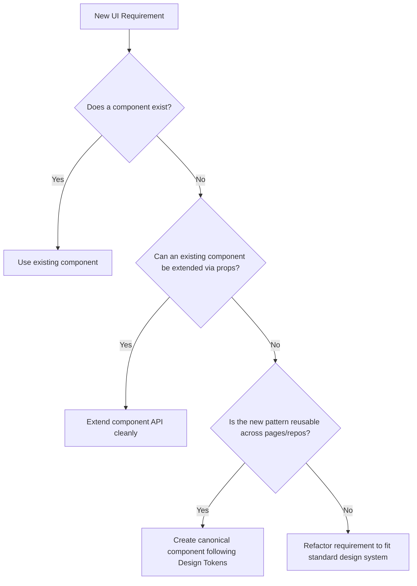

# dileepadev - Design System Specification & Frontend Guidelines

> **Practical visual guidance for AI coding agents** working on the dileepadev platform UI.
> This document synthesises the brand guide and the design-system contract into an
> agent-optimised reference with machine-readable frontmatter, golden rules, and a
> component checklist.
>
> All frontend applications, human engineers, and AI coding agents MUST adhere to the standards, tokens, and rules defined in this document. Do not fork or invent divergent patterns in individual applications.

## Related documents

| Document                                    | Authority                         | Purpose                                                                                      |
| :------------------------------------------ | :-------------------------------- | :------------------------------------------------------------------------------------------- |
| [`brand-guide.md`](docs/brand-guide.md)     | Brand identity authority          | Colour, type, logo, voice, portrait - the _what_ and _why_ of the brand                      |
| [`design-system.md`](docs/design-system.md) | Implementation contract authority | Tokens, components, states, layout, theming - the _how_, reconciled against the shipped site |
| **This file (`DESIGN.md`)**                 | AI agent reference                | Synthesises both into actionable rules, machine-readable YAML, component checklists          |
| `app/globals.css` + shipped site            | Ultimate source of truth          | When any document disagrees with what actually renders, the shipped CSS wins                 |

---

## Table of Contents

1. [Golden Rules for AI Coding Agents](#1-golden-rules-for-ai-coding-agents)
2. [Core Design Principles](#2-core-design-principles)
3. [Brand & Visual Identity](#3-brand--visual-identity)
4. [Design Tokens Reference](#4-design-tokens-reference)
5. [Color System & Theming](#5-color-system--theming)
6. [Typography & Text Hierarchy](#6-typography--text-hierarchy)
7. [Layout & Spatial Architecture](#7-layout--spatial-architecture)
8. [Responsive Design & Breakpoints](#8-responsive-design--breakpoints)
9. [Components & UI Patterns](#9-components--ui-patterns)
10. [Interaction States & Feedback](#10-interaction-states--feedback)
11. [Forms & Data Entry](#11-forms--data-entry)
12. [Tables & Data-Dense Interfaces](#12-tables--data-dense-interfaces)
13. [Icons, Media & Visual Assets](#13-icons-media--visual-assets)
14. [Borders, Radius & Elevation](#14-borders-radius--elevation)
15. [Motion & Animation](#15-motion--animation)
16. [Accessibility (a11y) Standards](#16-accessibility-a11y-standards)
17. [Content & Copywriting Standards](#17-content--copywriting-standards)
18. [Component Architecture & Extension Rules](#18-component-architecture--extension-rules)
19. [Do's and Don'ts Summary](#19-dos-and-donts-summary)

---

## 1. Golden Rules for AI Coding Agents

When writing or modifying UI components, pages, styles, or copy, AI agents must strictly abide by these core constraints:

1. **Emerald is the ONLY Accent**: Never introduce purple, blue, cyan, orange, or gold as brand accents. If an element needs emphasis, use Emerald (`var(--brand)`). Otherwise, use monochromatic neutral tones (`--fg`, `--fg-muted`, `--border`).
2. **Never Type Hex `#` in Components**: All colors must resolve from CSS variables (`var(--brand)`, `var(--bg-surface)`, `var(--border-strong)`, `var(--fg)`, `var(--fg-muted)`). Hardcoded hex creates visual drift and breaks theme switching.
3. **Emerald Appears ONCE per Surface**: Do not scatter emerald links, emerald tags, and emerald borders across the same card or section. The accent is a deliberate, singular focal point.
4. **Sentence Case Everywhere**: All headings, buttons, tabs, badges, table headers, and navigation items must be written in sentence case (e.g., `"Open source projects"`, `"Talks and workshops"`). No Title Case and no ALL-CAPS.
5. **Weights 400, 500, 700 Only**: Never apply `font-weight: 600` or `800`.
6. **One Control Height (40px)**: All buttons, text inputs, search fields, and select menus share a unified height: `--control-h: 40px`. They must line up flush on the same row.
7. **One Container Width (1020px)**: All pages and header/footer containers share `width: min(100% - var(--space-8), 1020px)`. Never create custom container widths.
8. **No Banned Jargon in Copy**: Never generate: _passionate about, leveraging, cutting-edge, revolutionize, game-changing, unlock, seamless, AI enthusiast, thought leader, journey, humbled to announce, 10x_. State facts and architecture plainly.

---

## 2. Core Design Principles

The dileepadev visual aesthetic is rooted in developer-tool craftsmanship, clarity, and deliberate minimalism. It avoids superfluous decorations, gradients, glows, and arbitrary animations, focusing on authentic information presentation.

### 2.1 Content-First Restraint

Every pixel exists to serve the content. If a border, background, or accent does not clarify hierarchy or enhance readability, remove it. White space (negative space) is an active structural choice, not empty void.

### 2.2 The Single Accent Rule

Emerald is the **only accent hue** across the platform. There is no secondary brand color, no purple, no cyan, and no yellow accent. When a UI element requires visual emphasis, it uses Emerald; otherwise, it relies on monochromatic neutral values (`--fg`, `--fg-muted`, `--border`).

### 2.3 Deliberate Emerald Placement

Emerald appears **at most once per surface** (section, card, dialog) as an intentional highlight. Scattering accent colors across multiple links, tags, and icons on the same card dilutes focus and breaks visual hierarchy.

### 2.4 Quiet Structural Framing

Structural containers (cards, panels, navigation bars, tables) remain quiet and unobtrusive. Hairline borders (`1px solid var(--border-strong)`) and subtle surface lifts (`var(--bg-surface)`) delineate components without shouting.

### 2.5 Predictable, Universal Interaction

Interactive affordances follow strict physical consistency across the platform:

- Interactive surfaces warm to `var(--surface-hover)` on hover.
- Interactive borders illuminate to `var(--brand)`.
- Focus indicators use a standardized, accessible focus ring.
- Transitions are swift, precise, and never sluggish (160ms brand ease).

### 2.6 Sentence Case Everywhere

All titles, navigation links, buttons, table headers, badges, and labels use **sentence case**. Title Case and ALL-CAPS are prohibited unless rendering an acronym (e.g., API, RSS, AWS, LLM) or a proper noun.

**The role is a proper noun: `AI Engineer`.** Title case wherever it is a label - the site `<title>`, the Person schema's `jobTitle`, the role line under the hero portrait, the terminal profile. The _discipline_ is not, and stays lowercase: "AI engineering" in a section intro, "an AI engineer" in the running prose of a biography.

---

## 3. Brand & Visual Identity

### 3.1 The Wordmark & Logo Lockup

The platform logo lockup consists of a neutral wordmark paired with an emerald trailing slash and dot (`/.`):

```html
<!-- Canonical markup -->
<a href="/#top" class="lockup" aria-label="dileepadev - home">
  <span class="wordmark">dileepadev</span>
  <span class="mark" aria-hidden="true">/</span>
</a>
```

- **Wordmark (`dileepadev`)**: Set in `Manrope`, 500 (medium) weight, `var(--fg)` neutral color, tracking `-0.02em`. It is **never** colored in emerald.
- **Mark (`/`)**: Set in `Manrope`, 700 (bold) weight, upright (non-italic in the modern v2.0 spec), `var(--brand)` emerald color, followed by an inline pseudo-dot (`::after`) in `var(--brand)`.
- **Spacing**: The slash sits `0.34em` from the wordmark with zero line breaks (`white-space: nowrap; flex: 0 0 auto;`).

### 3.2 Brand Accent Stops

- **Dark Theme (Carbon foundation)**: Uses **Emerald Bright** (`#23b888`). Delivering a 7.7:1 contrast ratio against the background (WCAG AAA).
- **Light Theme (Paper foundation)**: Uses **Emerald Deep** (`#087f5b`). Delivering a 4.7:1 contrast ratio against the background (WCAG AA).
- **Strict Prohibition**: Never use Emerald Deep on Carbon (illegible low contrast) and never use Emerald Bright on Paper (washed out, failing AA).

### 3.3 Tone of Voice

Direct, technical, and understated. Speak as an engineer explaining real systems to peers. Avoid hyperbole, self-congratulatory jargon, and buzzwords.

---

## 4. Design Tokens Reference

All design tokens are published via CSS custom properties. Applications MUST import the canonical token sheet (`brand-tokens.css`) or configure their utility framework (e.g., Tailwind CSS `@theme inline`) to resolve directly against these tokens.

### 4.1 Raw Color Palette

_Note: Raw palette tokens are defined for internal token derivation. Components must never reference raw palette tokens directly._

| Token              | Hex Value | Role / Lightness Reference                  |
| :----------------- | :-------- | :------------------------------------------ |
| `--emerald-bright` | `#23b888` | Dark-theme accent stop (WCAG AAA on dark)   |
| `--emerald-deep`   | `#087f5b` | Light-theme accent stop (WCAG AA on light)  |
| `--carbon`         | `#0d0d0d` | Deep black reference foundation             |
| `--paper`          | `#f7f7f7` | Crisp paper reference foundation            |
| `--ink-900`        | `#050505` | Canvas background in dark theme             |
| `--ink-800`        | `#0d0d0d` | Surface level 1 (cards, nav, inputs)        |
| `--ink-700`        | `#141414` | Raised surface level 2 (dialogs, dropdowns) |
| `--ink-600`        | `#1f1f1f` | Structural rule / hairline border           |
| `--ink-500`        | `#2e2e2e` | Component boundary / strong border          |
| `--ink-400`        | `#8d8d8d` | Secondary & muted text (6.1:1 on dark)      |
| `--ink-100`        | `#f1f1f1` | Primary text foreground (18.0:1 on dark)    |
| `--paper-0`        | `#ffffff` | Pure white surface level in light theme     |
| `--paper-50`       | `#f7f7f7` | Canvas background in light theme            |
| `--paper-200`      | `#e3e3e3` | Structural rule / hairline border           |
| `--paper-300`      | `#d2d2d2` | Component boundary / strong border          |
| `--paper-400`      | `#6a6a6a` | Secondary & muted text (5.0:1 on light)     |
| `--paper-900`      | `#131313` | Primary text foreground (17.0:1 on light)   |

---

### 4.2 Semantic Color Tokens

Components MUST reference these semantic tokens exclusively:

| Semantic Token    | Dark Mode Value              | Light Mode Value               | Description                                                    |
| :---------------- | :--------------------------- | :----------------------------- | :------------------------------------------------------------- |
| `--bg`            | `var(--ink-900)` (`#050505`) | `var(--paper-50)` (`#f7f7f7`)  | Default page canvas                                            |
| `--bg-surface`    | `var(--ink-800)` (`#0d0d0d`) | `var(--paper-0)` (`#ffffff`)   | Cards, navbars, inputs                                         |
| `--bg-raised`     | `var(--ink-700)` (`#141414`) | `var(--paper-0)` (`#ffffff`)   | Dialogs, menus, tooltips                                       |
| `--border`        | `var(--ink-600)` (`#1f1f1f`) | `var(--paper-200)` (`#e3e3e3`) | Structural rules & separators                                  |
| `--border-strong` | `var(--ink-500)` (`#2e2e2e`) | `var(--paper-300)` (`#d2d2d2`) | Boundaries, cards, input edges                                 |
| `--border-input`  | `#5b5b5b`                    | `#8f8f8f`                      | Form control borders (3.0:1 against `--bg`, WCAG 1.4.11 floor) |
| `--fg`            | `var(--ink-100)` (`#f1f1f1`) | `var(--paper-900)` (`#131313`) | Primary headings and text                                      |
| `--fg-muted`      | `var(--ink-400)` (`#8d8d8d`) | `var(--paper-400)` (`#6a6a6a`) | Secondary copy, dates, labels                                  |
| `--brand`         | `var(--emerald-bright)`      | `var(--emerald-deep)`          | Primary accent & active marks                                  |
| `--brand-fill`    | `var(--emerald-bright)`      | `var(--emerald-deep)`          | Solid filled button/badge background                           |
| `--on-brand`      | `var(--ink-900)`             | `var(--paper-0)`               | Text placed on `--brand-fill`                                  |
| `--success`       | `var(--brand)`               | `var(--brand)`                 | Positive state indicator                                       |
| `--error`         | `#e5484d` (5.0:1 on dark)    | `#c4292e` (4.8:1 on light)     | Destructive/error state indicator                              |
| `--warning`       | `#d97706`                    | `#b45309`                      | Cautionary state (never brand accent)                          |

---

### 4.3 Derived Interaction Tokens

These tokens are computed via standard `color-mix` formulas so they dynamically adjust to both dark and light modes without manual recalculation:

```css
:root {
  /* Hover surface for cards, chips, rows, icon buttons */
  --surface-hover: color-mix(in srgb, var(--fg) 7%, var(--bg-surface));
  --raised-hover: color-mix(in srgb, var(--fg) 9%, var(--bg-surface));

  /* Brand filled button interaction states */
  --brand-fill-hover: color-mix(in srgb, var(--brand-fill) 88%, var(--fg));
  --brand-fill-active: color-mix(in srgb, var(--brand-fill) 78%, var(--fg));

  /* Universal focus and emphasis ring */
  --ring: color-mix(in srgb, var(--brand) 32%, transparent);
  --ring-width: 3px;

  /* Global text selection tint */
  --selection-bg: color-mix(in srgb, var(--brand) 28%, transparent);
}
```

---

### 4.4 Spacing Scale

The spacing system uses a **base-4 / base-8 pixel progression**:

| Space Token  | CSS Value | Pixels | Canonical Usage                                                      |
| :----------- | :-------- | :----- | :------------------------------------------------------------------- |
| `--space-1`  | `0.25rem` | `4px`  | Fine adjustments, dot spacing, chip icon gap                         |
| `--space-2`  | `0.5rem`  | `8px`  | Icon-to-text gap, compact button padding, badge padding              |
| `--space-3`  | `0.75rem` | `12px` | Input vertical padding, card sub-gaps                                |
| `--space-4`  | `1rem`    | `16px` | Card internal padding, grid gap, paragraph gap                       |
| `--space-5`  | `1.25rem` | `20px` | List item vertical padding, form field gap                           |
| `--space-6`  | `1.5rem`  | `24px` | Section subheadings, entry row padding                               |
| `--space-8`  | `2rem`    | `32px` | Container margins, header spacing, large gutters                     |
| `--space-10` | `2.5rem`  | `40px` | Major section-intro margins, card grid offsets                       |
| `--space-12` | `3rem`    | `48px` | Layout spacing on tablet and desktop                                 |
| `--space-16` | `4rem`    | `64px` | Section vertical padding (`.section { padding: var(--space-16) 0 }`) |

---

### 4.5 Border Radius & Hairlines

The shape language uses four discrete radius steps and a pill:

| Radius Token    | Value   | Applied To                                              |
| :-------------- | :------ | :------------------------------------------------------ |
| `--hairline`    | `1px`   | All borders, rules, dividers, input edges               |
| `--radius-sm`   | `6px`   | Chips, stack tags, status pills, small controls         |
| `--radius`      | `8px`   | Default buttons, input fields, cards, media             |
| `--radius-lg`   | `12px`  | Large cards, modal dialogues, floating panels           |
| `--radius-xl`   | `16px`  | Navigation bars, master containers                      |
| `--radius-pill` | `999px` | Round avatars, scrollbar thumbs, badges, dot indicators |

---

### 4.6 Control Heights

To ensure inputs, buttons, and selects align seamlessly when placed adjacent on the same row:

- `--control-h`: `40px` (standard desktop & mobile interactive control height).
- Form inputs, secondary buttons, primary buttons, search inputs, and dropdown triggers must all conform to `--control-h: 40px`.

---

### 4.7 Motion & Timing

All interactive transitions follow a single easing and duration:

- `--dur`: `160ms`
- `--ease`: `cubic-bezier(0.4, 0, 0.2, 1)`
- Rule: Avoid long, bouncy animations. Transitions must feel instant and mechanical.

---

## 5. Color System & Theming

### 5.1 Theme Cascading Order

Themes are toggled via the `data-theme` attribute on the root `<html>` element:

- Default: Dark mode (`:root`, `[data-theme="dark"]`).
- Light: Explicit light mode (`[data-theme="light"]`).
- System Preference: Automatically applies light variables when `prefers-color-scheme: light` matches and no explicit `data-theme` override is stored.

### 5.2 Text Selection

Text selection must follow the platform's translucent emerald tint while preserving original foreground text contrast:

```css
::selection {
  background: color-mix(in srgb, var(--brand) 28%, transparent);
  color: inherit;
}
```

### 5.3 Semantic Status Indicators

- **Success**: Uses `--brand` (Emerald). The brand color _is_ the success color.
- **Error**: High-visibility crimson red (`#e5484d` on dark, `#c4292e` on light). Reserved exclusively for destructive states, validation errors, and operational failures.
- **Warning**: Amber (`#d97706` on dark, `#b45309` on light). Used only for non-blocking warnings or pending actions; never as a decorative accent.

---

## 6. Typography & Text Hierarchy

### 6.1 Font Families

| Role             | Family             | Fallback Stack                           | Used For                                                              |
| :--------------- | :----------------- | :--------------------------------------- | :-------------------------------------------------------------------- |
| **Sans / UI**    | `Manrope`          | `system-ui, -apple-system, sans-serif`   | Display, headings, body text, UI controls, navigation                 |
| **Monospace**    | `JetBrains Mono`   | `ui-monospace, "SF Mono", monospace`     | Code blocks, inline code, dates, route paths (`./blog/...`), metadata |
| **System Emoji** | Native Emoji Stack | `Apple Color Emoji, Segoe UI Emoji, ...` | Reaction glyphs and platform emojis                                   |

### 6.2 Type Weights

Only three font weights are permissible across the entire platform:

- **400 (Regular)**: Body text, long-form articles, paragraphs.
- **500 (Medium)**: Headings (h2, h3), button labels, navigation links, section labels, form labels.
- **700 (Bold)**: Main h1 titles, display numbers, emphasis marks.
- **Weight 600 is strictly prohibited** to prevent font asset bloat and visual inconsistency.

---

### 6.3 Type Scale

| Step      | Font Size         | Line Height | Tracking  | Weight    | Applied To                                             |
| :-------- | :---------------- | :---------- | :-------- | :-------- | :----------------------------------------------------- |
| `display` | `2.75rem` (44px)  | `1.1`       | `-0.02em` | 700       | Hero title, major statistical highlights               |
| `h1`      | `2.25rem` (36px)  | `1.15`      | `-0.02em` | 700       | Page titles (`<h1>`)                                   |
| `h2`      | `1.375rem` (22px) | `1.3`       | `-0.02em` | 700 / 500 | Major section titles, modal headings                   |
| `h3`      | `1.125rem` (18px) | `1.35`      | `0`       | 500       | Card titles, item titles, subheadings                  |
| `body`    | `1rem` (16px)     | `1.65`      | `normal`  | 400       | General running copy, article body                     |
| `small`   | `0.875rem` (14px) | `1.55`      | `0.01em`  | 400 / 500 | Button labels, input text, card descriptions, metadata |
| `label`   | `0.75rem` (12px)  | `1.45`      | `0.01em`  | 500       | Badges, chips, kickers, timestamps, table headers      |

**Tracking note:** `-0.02em` also applies to text set at the H3 _size_ when it serves as a title (card titles, entry titles, item titles) - but not to the bare `<h3>` element itself. `0.01em` applies to label-sized and mono UI text (badges, chips, nav links, button labels, metadata).

---

### 6.4 Readability & Line Length (The 68ch Rule)

Running prose and descriptive paragraphs MUST be capped at **68 characters** (`max-width: 68ch`). Excessively wide text blocks impair line-tracking and cause reading fatigue. When a paragraph sits within a wider container, enforce `max-width: 68ch`. Use `max-w-none` only when the element intentionally spans a grid track.

---

## 7. Layout & Spatial Architecture

### 7.1 The Single Container Measure

To eliminate the jarring visual disjoint between different page widths:

- **Universal Container Width**: `width: min(100% - var(--space-8), 1020px)`.
- Applied identically to navigation headers, footers, homepage sections, index directories, and detail views.
- No page may exceed `1020px` maximum content width unless rendering full-screen visual canvas applications.

```css
.container {
  width: min(100% - var(--space-8), 1020px);
  max-width: none;
  margin-inline: auto;
}
```

### 7.2 Section Rhythm & Separation

- Every major section is vertically padded by `--space-16` (64px) top and bottom:

  ```css
  .section {
    padding: var(--space-16) 0;
    border-top: var(--hairline) solid var(--border);
    scroll-margin-top: 80px; /* Clears sticky header */
  }
  ```

- Major section dividers use a quiet hairline rule (`border-top: 1px solid var(--border)`).
- Subsections within a section use `margin-top: var(--space-16)` with a dedicated accent tick (`.subsection-title::before`).

---

## 8. Responsive Design & Breakpoints

### 8.1 Breakpoint Scale

Design mobile-first, progressively enhancing as viewport width expands:

| Breakpoint | Minimum Width | Target Devices              | Layout Behavior                                         |
| :--------- | :------------ | :-------------------------- | :------------------------------------------------------ |
| `base`     | `0px`         | Phones (<640px)             | 1 column, stacked controls, full-width inputs           |
| `sm`       | `640px`       | Large phones, small tablets | 2-column card grids, adjacent filters                   |
| `md`       | `768px`       | Tablets, portrait displays  | Full desktop navbar links expand, search inline         |
| `lg`       | `1024px`      | Laptops & desktop displays  | 3-column card grids, two-column article rails           |
| `xl`       | `1280px`      | Large monitors              | Retains 1020px container centered with spacious margins |

**Practical responsive thresholds in implementation:**

- **768px (Navigation threshold):** Switches between desktop inline navigation (`.nav-links`) and the mobile toggle button (`.nav-mobile-toggle`) with dropdown menu (`.nav-mobile-menu`).
- **720px (Content layout threshold):** Mobile overrides via `max-width: 720px` query: the display title steps down to 34px (`2.125rem`), section padding reduces to `--space-12`, hero and entry/item grids collapse to 1 column, and gallery drops to 2 columns.

### 8.2 Touch Target Quality Floor

- All interactive targets on touch devices must measure at least **44 × 44px** in physical tapping area.
- Compact visual elements (such as 32px icon buttons or 24px close triggers) must extend their hit area via transparent padding or pseudo-elements (`::after { inset: -8px; }`).

### 8.3 Horizontal Scroll Prevention

Horizontal scroll on mobile is a critical bug. Every element, table, code block, or preformatted string must wrap or handle overflow explicitly (`overflow-x: auto` on tables/code, `min-w-0` on flex/grid children).

---

## 9. Components & UI Patterns

### 9.1 Buttons (`Button`, `LinkButton`)

Buttons trigger actions; link buttons navigate. Both share identical visual styling.

- **Primary (`.btn--primary`)**: Solid emerald fill (`var(--brand-fill)`), dark text (`var(--on-brand)`), 500 weight. Used for the single primary call-to-action on a screen (e.g., "Send message", "Publish").
- **Secondary (`.btn--secondary`)**: Transparent background, hairline border (`var(--border-strong)`), foreground text (`var(--fg)`). Used for secondary or dismissive actions.
- **Heights**: Always conform to `min-height: var(--control-h)` (40px).

```html
<!-- Primary Button -->
<button class="btn btn--primary">Save changes</button>

<!-- Secondary Button -->
<button class="btn btn--secondary">Cancel</button>
```

---

### 9.2 Links & External Link Indicators

- **Default Link Colour**: `color: inherit` - a link reads as part of its surrounding text unless the component it belongs to deliberately states a colour. This keeps emerald meaningful: if every link were green, none would stand out. A component styles its own links (nav items step to `--brand` on current/hover, entry org names use `--brand`, footer links use `--fg-muted` stepping to `--brand` on hover).
- **Long-form Prose Exception**: `.prose a` gets `var(--brand)` with an underline by default, because an unstyled link would otherwise be invisible against its own paragraph.
- **External Links**: When navigating outside the application (`target="_blank"`), an external diagonal arrow glyph is automatically appended:

```css
a[target="_blank"]:not(.no-external)::after {
  content: "";
  display: inline-block;
  width: 0.72em;
  height: 0.72em;
  margin-left: 0.28em;
  vertical-align: 0.05em;
  background-color: currentColor;
  mask: url("data:image/svg+xml,...") no-repeat center / contain;
  opacity: 0.65;
  transition:
    opacity 160ms ease,
    transform 160ms ease;
}
a[target="_blank"]:hover::after {
  opacity: 1;
  transform: translate(1px, -1px);
}
```

---

### 9.3 Cards (`Card`)

Cards group related content on a surface.

- **Structure**: Rounded corners (`--radius-lg` / 12px or `--radius` / 8px), surface background (`var(--bg-surface)`), hairline border (`var(--border-strong)`), internal padding `--space-6` (24px) or `--space-4` (16px).
- **Interactive Cards**: When wrapped as a link, the card lifts to `var(--surface-hover)` and its border warms to `var(--brand)`.

```tsx
<div className="card flex flex-col justify-between">
  <div>
    <div className="icon-box">...</div>
    <h3>Title in sentence case</h3>
    <p>Descriptive copy explaining the item.</p>
  </div>
</div>
```

---

### 9.4 Badges & Chips (`Badge`, `Chip`)

Badges label or categorize. Chips represent metadata tags or technology stacks.

- **Default Badge**: Neutral surface (`var(--bg-surface)`), muted text (`var(--fg-muted)`), hairline border (`var(--border-strong)`), `0.75rem` (12px), 500 weight. Static by default (`cursor: default`) without hover states.
- **Filled Badge (`badge--ship`)**: Reserved for a single accent per surface (e.g., active release, featured status).
- **Stack Chip (`Chip`)**: Rendered in `JetBrains Mono` font (`font-mono text-label/[1] tracking-[0.01em]`), `--radius-sm` (6px). Static by default (`cursor: default`) without hover states. The base sheet enforces this too - `.chip:hover` is scoped to `a`/`button` ancestors and `.chip--interactive`, because a `cursor: default` utility on the component does not cancel a colour change coming from the stylesheet underneath it.
- **Interactive Badges & Chips**: Only clickable chips or badges (e.g., tag archive links, filter buttons, or when marked `interactive={true}`) receive `cursor: pointer` and the hover formula (`hover:border-brand hover:bg-surface-hover hover:text-fg`). Purely informational chips (status pills, stack tags, read-only labels) never flash hover effects to prevent false interactive affordances.

---

### 9.5 Status Badges (`StatusBadge`)

Indicates live operational state (e.g., "Available for contract", "Operational", "Active", "Current", "Upcoming"):

- Conforms to the canonical `<Chip>` specification (`var(--radius-sm)`, `var(--border-strong)`, `var(--bg-surface)`, `var(--font-mono)`).
- Static by default (`cursor: default`, no hover transitions).
- Features a solid 6px indicator dot on the left, paired with `0.75rem` label text.
- Dot color reflects semantic state: Emerald (`var(--brand)`) for active/current/upcoming, amber for pending/maintenance, crimson for error/offline.

---

### 9.6 Page Paths (`PagePath`)

All detail views and index pages display their relative route path using an independently segmented breadcrumb format:

```html
<!-- Example output -->
<nav aria-label="Breadcrumb path" class="page-path">
  <a href="/">home</a>
  <span aria-hidden="true">/</span>
  <a href="/blog">blog</a>
  <span aria-hidden="true">/</span>
  <a href="/blog/my-post" aria-current="page">my-post</a>
</nav>
```

- **Format**: Starts with `home` linking to `/`, followed by `/`-delimited, independently clickable segments (e.g., `home / events`, `home / blog / my-post`).
- **Typography**: Set in `JetBrains Mono` (`font-mono text-label`), muted color (`var(--fg-muted)`), sentence/lower case.
- **Spacing**: Separated with `gap-1.5` (~6px) between location names and delimiters.
- **Interaction**: Each location is an independent interactive link with its own emerald hover and focus states.

---

### 9.7 Search Input (`SearchInput`)

- Fixed 40px height (`--control-h`).
- Features a leading search icon, clear button (`X`) when text is entered, and a keyboard hotkey indicator (`/`).
- Pressing `/` anywhere on the page focuses the search bar (unless already focused on an input or textarea).
- Pressing `Escape` clears current query or blurs the input.

---

### 9.8 Custom Sort Select (`SortSelect`)

Replaces unstyled native OS `<select>` elements with an accessible, keyboard-navigable combobox menu:

- Trigger matches `--control-h` (40px) with leading `ArrowUpDown` icon and trailing chevron.
- Dropdown menu floats on `var(--bg-raised)` with 1px border and elevation shadow.
- Fully accessible with `role="combobox"`, `role="listbox"`, and `aria-selected="true"`.
- Supports `ArrowUp`, `ArrowDown`, `Enter`, `Space`, and `Escape` keyboard navigation.

---

### 9.9 Lists: Items & Entries

- **Entry List (`EntryList`, `Entry`)**: Used for chronological timelines (experience, education). Two-column layout: 160px date column on the left (monospace), content and organization on the right. Collapses to 1 column on mobile.
- **Item List (`ItemList`, `Item`)**: Used for rich listings (events, posts, projects, videos). Content title and description on the left, 180px right-aligned metadata column on the right.

---

### 9.10 Empty States (`EmptyState`)

When a list, search query, or table yields zero records, never display a blank white page:

- Must provide a clear title in sentence case (e.g., "No posts match your search").
- A constructive hint suggesting action (e.g., "Try clearing the search filter or checking back later").
- An optional secondary action button (e.g., "Clear filters").

---

### 9.11 Navigation Bar (`Navbar`)

A floating pill sticky to the viewport top (`site-header` at `top: 1rem`):

- **Desktop (≥768px)**: Renders brand lockup, inline `.nav-links` (styled in `--text-small`, weight 500, `--track-label`), and control actions (ThemeToggle).
- **Mobile (<768px)**: Replaces horizontal overflow with a compact mobile menu toggle (`Menu`/`X` Lucide icons) triggering an animated dropdown menu (`.nav-mobile-menu`) with clear Section and Explore links.
- **Elevation**: Translucent surface (`var(--bg-surface)` with 18px backdrop blur) and `--shadow-nav` elevation shadow (the only floating shadow in the system).

---

## 10. Interaction States & Feedback

Every interactive element must support the complete state matrix:

| State                | Visual Behavior                                                                         | CSS / Accessibility Rule                                          |
| :------------------- | :-------------------------------------------------------------------------------------- | :---------------------------------------------------------------- |
| **Default**          | Resting token values (`var(--bg-surface)`, `var(--border-strong)`)                      | Standard resting contrast                                         |
| **Hover**            | Background warms to `var(--surface-hover)`, border warms to `var(--brand)`              | `transition: background 160ms ease, border-color 160ms ease`      |
| **Focus-Visible**    | 2px solid `var(--brand)` outline with 2px offset OR 3px soft focus ring (`var(--ring)`) | `:focus-visible` only (suppress default mouse focus outlines)     |
| **Active / Pressed** | Scale transforms slightly (`scale(0.98)`), surface deepens to `var(--raised-hover)`     | Immediate tactile feedback                                        |
| **Disabled**         | Opacity reduced to `0.5`, pointer cursor replaced with `not-allowed`                    | `disabled` attribute + `aria-disabled="true"`                     |
| **Invalid**          | Border switches to `var(--error)` crimson red                                           | Use `:user-invalid` so fields do not scream error on initial load |

---

## 11. Forms & Data Entry

### 11.1 Form Layouts

- Form fields should be organized in single-column stacks or clean 2-column grids with `--space-5` (20px) gap.
- Form inputs, textareas, and buttons must be 100% width of their grid track.

### 11.2 Field Labels & Associations

- Every form field MUST have a programmatically linked `<label>` using `htmlFor` and matching `id`.
- Required fields are denoted with an emerald asterisk `<span class="req">*</span>` with appropriate `aria-required="true"`.
- Labels must be situated directly above their input (`margin-bottom: var(--space-2)`). Never use floating labels that disappear on typing.

### 11.3 Input Sizing

- Single-line inputs (`type="text"`, `type="email"`, `type="search"`, `type="password"`) must measure exactly **40px height** (`--control-h`).
- Input borders use `--border-input` (`#5b5b5b` on dark, `#8f8f8f` on light) - a distinct token held to a 3.0:1 contrast floor against the page background per WCAG 1.4.11.
- Multi-line inputs (`textarea`) must have a minimum height of `140px` (or `96px` for comments) and allow vertical resizing only (`resize: vertical`).

### 11.4 Non-Intrusive Validation (`:user-invalid`)

Do not display validation errors while a user is actively typing or before they have interacted with a field:

- Use CSS `:user-invalid` instead of bare `:invalid`. This ensures that required fields remain quiet until the user has blurred or attempted submission.
- Error messages must sit beneath the input in crimson text (`text-error text-small`) accompanied by an explanatory sentence explaining how to resolve it.

---

## 12. Tables & Data-Dense Interfaces

Tables are the backbone of administration dashboards and data directories.

### 12.1 Table Structure & Rhythm

- **Borders**: Subtle horizontal dividers (`1px solid var(--border)`). Avoid vertical column borders.
- **Row Heights**: Standard row height 44px to 52px. Compact data rows 36px.
- **Padding**: Cell padding `--space-3 var(--space-4)` (12px vertical, 16px horizontal).
- **Headers**: Styled in `font-mono text-label uppercase text-fg-muted font-medium tracking-wide`, top border and bottom border.

### 12.2 Column Alignment Rules

- **Text / Names / Titles**: Always left-aligned.
- **Numeric values / Dates / Statuses**: Monospace font (`font-mono`), right-aligned or centered for status dots.
- **Actions column**: Always right-aligned, pinned to the right edge.

### 12.3 Responsive Tables

Tables with more than 3 columns must wrap in an overflow container (`overflow-x: auto`) with a subtle fade mask or scrollbar indicator on mobile devices, ensuring phone viewports do not blow out horizontally.

---

## 13. Icons, Media & Visual Assets

### 13.1 Icon System (Three Conventions)

- **Interface Icons**: Standardized on **Lucide Icons** (`lucide-react`) across UI controls, search, dropdowns, and toggles.
- **Pillar Marks**: The six About-card marks - AI engineering, open source, public speaking, technical writing, technical videos, community building. Source of truth is `docs/brand/icons/`, where each ships as a plain `.svg`, a `-badge.svg` on a Carbon field, a `-symbol.svg`, and a `.png`. `components/icons/PillarIcons.tsx` ports the **`-symbol`** variant, because it strokes `currentColor`: the card colours the mark through `text-brand`, so it resolves to Emerald Bright on Carbon and Emerald Deep on Paper. A hard-coded `#23B888` would be correct in one theme and a contrast failure in the other. The API serves twelve `PillarIcon` names against six marks, and the map collapses them by concept - **never mix a Lucide fallback into that grid**.
- **Brand & Social Glyphs**: Third-party marks (GitHub, LinkedIn, X, YouTube, etc.) use hand-authored inline SVGs centralized in `lib/social-icons.ts` (`24×24` viewBox, `fill="currentColor"`).
- **Stroke Width**: Standardized at `1.75` (or `2.0` for compact 14px icons). Do not use thin 1.0 or heavy 3.0 strokes.
- **Icon Sizing**:
  - Small / inline with text: `14px` (`h-3.5 w-3.5`).
  - Standard control / button icon: `16px` (`h-4 w-4`).
  - Feature / card header icon: `18px` to `20px` (`h-4.5 w-4.5` or `h-5 w-5`).
- Icons must always be accompanied by accessible text or carry `aria-hidden="true"` when paired with a visible label.

### 13.2 Photography Budget & Image Rules

- **Budget**: Photographs appear in exactly **two places**: the hero portrait and the event gallery. Do not clutter technical interfaces with decorative stock photos.
- **Aspect Ratios**: Standardized to `4:3` (event gallery) or `16:9` (project cards).
- **Image Treatment**: Hairline border (`1px solid var(--border-strong)`), rounded corners (`--radius-lg`), and subtle dark scrim for text overlays.

---

## 14. Borders, Radius & Elevation

### 14.1 Border-First Elevation

dileepadev uses a **border-first elevation model** rather than heavy drop shadows:

- Depth is expressed by lifting the surface color (`--bg` → `--bg-surface` → `--bg-raised`) and framing with hairline borders (`--border` / `--border-strong`).
- Heavy, muddy drop shadows are strictly prohibited.

### 14.2 Navigational Shadows

The single permitted elevation shadow in the system is the floating navigation shadow:

- **Dark Mode**: `--shadow-nav: 0 10px 30px rgb(0 0 0 / 0.45)`
- **Light Mode**: `--shadow-nav: 0 8px 24px rgb(0 0 0 / 0.06), 0 1px 2px rgb(0 0 0 / 0.05)`

---

## 15. Motion & Animation

### 15.1 Micro-Interactions Only

Animation is functional, never decorative. It signals state transition, directional navigation, or feedback.

- All transitions must complete within **160ms** (`var(--dur)`).
- Use the standard easing curve: `cubic-bezier(0.4, 0, 0.2, 1)`.
- Directional translations on hover must not exceed **2px to 3px** (e.g., `translate-x-0.5 -translate-y-0.5` on external arrows).

### 15.2 Prefers-Reduced-Motion Quality Floor

Every application MUST include the global reduced-motion override:

```css
@media (prefers-reduced-motion: reduce) {
  *,
  *::before,
  *::after {
    animation-duration: 0.01ms !important;
    animation-iteration-count: 1 !important;
    transition-duration: 0.01ms !important;
    scroll-behavior: auto !important;
  }
}
```

---

## 16. Accessibility (a11y) Standards

Accessibility is a non-negotiable core quality floor.

### 16.1 Contrast Compliance

- All normal text must maintain at least **4.5:1** contrast against its background (WCAG AA).
- Large text (above 24px) and primary headings must maintain at least **3:1** contrast.
- Primary text on dark (`--fg` on `--bg`) delivers **18.0:1**; muted text (`--fg-muted` on `--bg`) delivers **6.1:1**. Both exceed AA minimums.

### 16.2 Visible Focus Indicators

- Every focusable element must have a clear `:focus-visible` indicator.
- Never use `outline: none` without providing an immediate replacement focus ring (`box-shadow: 0 0 0 3px var(--ring)`).

### 16.3 Semantic Landmarks & HTML

- Use real HTML elements: `<main>`, `<nav>`, `<header>`, `<footer>`, `<section>`, `<article>`, `<button>`, `<dialog>`.
- Never use `<div onClick="...">` in place of a `<button>`. A button handles keyboard events (`Enter`, `Space`) and screen reader roles automatically.

### 16.4 Heading Order

Heading levels describe the document outline; the type scale describes the size. They are set
independently, and a heading must never skip a level to get the size you want.

- The homepage runs `h1` (hero) → `h2` (section) → `h3` (item title).
- An index page has no section heading between its `h1` and its list, so item titles there are
  `h2`. `Item` takes a `headingLevel` prop for exactly this; `.item-title` holds the H3 type step
  either way, so the two look identical and only the outline differs.
- Subsection titles (`.subsection-title`) are deliberately **not** headings. They are a `<span>`,
  which is what keeps `h2` → `h3` contiguous inside a section that groups several lists.

### 16.5 Accessible Names Must Contain the Visible Label

WCAG 2.5.3. When a control has visible text, its accessible name must contain that text, in
order. An `aria-label` that replaces the visible label - `aria-label="Copy hex code for Emerald
Bright"` on a swatch that reads "Emerald Bright #23B888" - breaks voice control: the words a
person can see are not the words that activate the control.

Where a control needs its action announced as well as its content, append the action in an
`sr-only` span rather than overriding the name with `aria-label`.

---

## 17. Content & Copywriting Standards

### 17.1 Sentence Case Rule

Use sentence case across the entire interface:

- Headings: `"Talks and workshops"`, not `"Talks And Workshops"`.
- Buttons: `"Send message"`, not `"Send Message"`.
- Badges: `"Open source"`, not `"OPEN SOURCE"`.

### 17.2 Banned Copywriting Jargon

The following terms are banned without exception across all copy and documentation:

- _passionate about_
- _leveraging_
- _cutting-edge_
- _revolutionize_
- _game-changing_
- _unlock_
- _seamless_
- _AI enthusiast_
- _thought leader_
- _journey_
- _humbled to announce_
- _10x_

---

## 18. Component Architecture & Extension Rules

Before creating a new UI component in any repository, evaluate this decision hierarchy:



### Component Development Checklist

1. **Design Tokens Only**: Does the component use `var(--brand)`, `var(--fg)`, `var(--bg-surface)`, etc.? No hardcoded hex `#`.
2. **Standard Controls**: Does its height align with `--control-h: 40px` if it is an interactive input or button?
3. **Keyboard Accessible**: Can a user Tab to it and activate it with `Enter` or `Space`?
4. **Theme Tested**: Does it look balanced and high-contrast in both Dark and Light themes?
5. **Mobile Responsive**: Does it adapt without horizontal overflow on a 360px viewport?
6. **Sentence Case**: Are all labels and titles formatted in sentence case?

---

## 19. Do's and Don'ts Summary

| Category       | Do                                                                 | Don't                                                           |
| :------------- | :----------------------------------------------------------------- | :-------------------------------------------------------------- |
| **Color**      | Use Emerald as the sole accent color on the page.                  | Introduce a second accent color (purple, cyan, blue, gold).     |
| **Contrast**   | Use Emerald Bright on Dark and Emerald Deep on Light.              | Put Emerald Deep on Dark or Emerald Bright on Light.            |
| **Typography** | Use weights 400, 500, and 700 only.                                | Load weight 600 or 800.                                         |
| **Casing**     | Use sentence case everywhere.                                      | Use Title Case or uppercase headings.                           |
| **Spacing**    | Use the standard spacing scale (`--space-1` through `--space-16`). | Invent arbitrary pixel margins (e.g., `margin-top: 19px`).      |
| **Buttons**    | Keep one primary button per screen/form.                           | Clutter a page with three competing primary buttons.            |
| **Links**      | Provide external arrow glyphs for links leaving the platform.      | Scatter arrows on internal site navigation links.               |
| **Elevation**  | Use hairline borders (`1px solid var(--border-strong)`).           | Add heavy, blurry drop shadows or neon box-glows.               |
| **Focus**      | Provide the standard 3px focus ring on `:focus-visible`.           | Strip focus outlines with `outline: none;` without replacement. |
| **Motion**     | Keep transitions at 160ms with brand easing.                       | Add slow, bouncy, or distracting decorative animations.         |
| **Copy**       | State facts, architecture, and real engineering outcomes.          | Use marketing buzzwords like "cutting-edge" or "seamless".      |

---

_This file serves as the canonical DESIGN.md specification for the dileepadev platform. All frontend applications and AI agents must apply these rules whenever generating or modifying frontend code._
